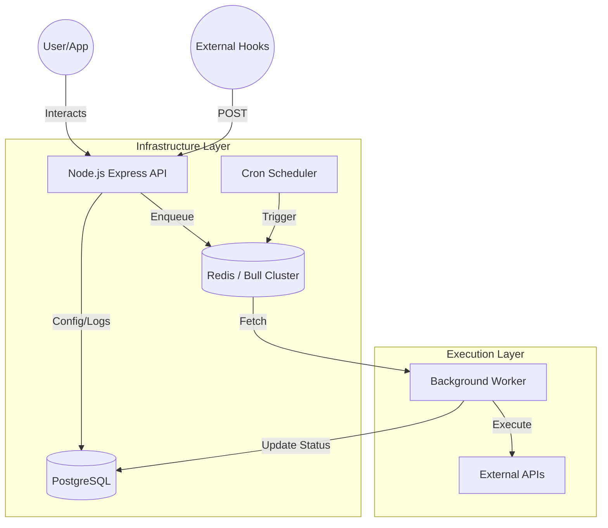

# 🚀 Workflow Automation Engine (Nexus Flow)

[](https://opensource.org/licenses/MIT)
[](https://nodejs.org/)
[](https://www.docker.com/)
[](https://kubernetes.io/)

**Nexus Flow** is a high-performance, self-hosted workflow automation platform designed to orchestrate complex task sequences. Whether triggered by external webhooks or precisely timed cron schedules, Nexus Flow ensures your automations run reliably at scale.


---

## 🔥 Key Features

-   **🎯 Intelligent Triggers**: 
    -   **Webhook Ingress**: Unique endpoint generation for external service integration (GitHub, Stripe, etc.).
    -   **Temporal Scheduling**: Full cron-syntax support for periodic task execution.
-   **⚡ Distributed Processing**: 
    -   Leverages **Bull (Redis-backed)** for asynchronous job queuing.
    -   Dedicated **Workers** for compute-heavy actions, ensuring the API remains responsive.
-   **🛠 Extensible Action Suite**:
    -   **Generic HTTP**: Full control over methods, headers, and payloads for API orchestration.
    -   **Internal Tasking**: Mock action system for prototyping and internal logging.
-   **📊 Observability**:
    -   Real-time **Execution History** with detailed input/output payload tracking.
    -   Success/Failure analytics and dashboard overviews.
-   **🔐 Enterprise-Grade Security**:
    -   JWT-based authentication with Bcrypt password hashing.
    -   Environment-isolated configuration.

---

## 🏗 System Architecture

Nexus Flow follows a modern microservices pattern, decoupling the API, the scheduler, and the task processor.



---

## 🛠 Tech Stack

| Component | Technology | Description |
| :--- | :--- | :--- |
| **Frontend** | React + Vite | Fast, modern SPA with custom UI components. |
| **Backend** | Node.js (Express) | High-concurrency API server. |
| **Job Queue** | Bull / Redis | Distributed message broker for task persistence. |
| **Database** | PostgreSQL | Relational storage for workflows and history. |
| **DevOps** | Docker / K8s | Containerization and orchestration manifests. |
| **CI/CD** | Jenkins | Automated pipeline for building, testing, and pushing. |

---

## 🚀 Getting Started (Quick Start)

### Prerequisites
- Docker & Docker Compose (v2.0+)
- Node.js 18+ (for manual dev)

### 🐳 Run with Docker (Recommended)

1.  **Clone the Repository**:
    ```bash
    git clone <repository-url>
    cd workflow-automation
    ```

2.  **Launch the Stack**:
    ```bash
    docker-compose up -d --build
    ```

3.  **Access the Platform**:
    -   **Portal**: [http://localhost:8740](http://localhost:8740)
    -   **API Root**: [http://localhost:5000](http://localhost:5000)

4.  **Default Admin Login**:
    -   **User**: `admin@example.com`
    -   **Pass**: `admin`

---

## ☸️ Kubernetes (Production Ready)

Nexus Flow is ready for the cloud with pre-configured manifests in the `k8s/` directory.


### Deploying to a Cluster
```bash
# 1. Enter the namespace
kubectl create namespace nexus-flow

# 2. Apply all manifests (Secrets, PVCs, Services, Deployments)
kubectl apply -f k8s/ -n nexus-flow

# 3. Verify Rollouts
kubectl rollout status deployment/backend -n nexus-flow
```

---

## 🔄 CI/CD Jenkins Pipeline

The project includes a production-grade `Jenkinsfile` for automated lifecycle management.


The pipeline automates:
- **Security Scans**: Identifying sensitive environment leaks.
- **Artifact Build**: Building optimized Docker images for frontend and backend.
- **Integrity Testing**: Spawning a temporary environment for automated health checks.
- **Registry Push**: Pushing tagged images to Docker Hub.
- **K8s Rollout**: Rolling updates to the target Kubernetes cluster.

---

## 📸 Screenshots

| Dashboard | Workflow Builder | History |
| :---: | :---: | :---: |
|  |  |  |

---

## 📂 Project Structure

```text
.
├── backend/            # Express API, Bull Worker, Cron Scheduler
├── frontend/           # React + Vite Application
├── k8s/                # Production Kubernetes Manifests
├── photo/              # Media Assets & Screenshots
├── Docker-compose.yml  # Local Orchestration
├── Jenkinsfile         # CI/CD Pipeline Definition
└── init.sql            # Database Schema Initialization
```
